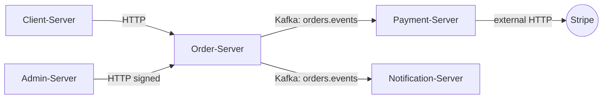

# Architecture

## Topology

<A diagram. Mermaid is rendered by GitHub; ASCII is fine too. Show the units as boxes, the links between them as arrows labeled with the mechanism (HTTP, Kafka topic, shared DB, etc.).>

## Cross-unit interactions

| From          | To            | Mechanism                     | Purpose                        |
|---------------|---------------|-------------------------------|--------------------------------|
| <unit-a>      | <unit-b>      | <HTTP / topic / shared-db>    | <why this call exists>         |
| ...           | ...           | ...                           | ...                            |

## Auth + trust boundaries
<Where do requests come from? How are they authenticated at each layer? Internal service-to-service auth vs external user auth.>

## Data stores
<Which unit owns which table / index / cache. Shared stores flagged explicitly — they are where coupling hides.>

## Infra
- **Containers:** <Dockerfiles, base images>
- **Orchestration:** <k8s manifests? compose? managed PaaS?>
- **CI/CD:** <which files, which branches deploy where>
- **Environments:** <dev / staging / prod, how they differ>
- **Secrets:** <where secrets live — vault, k8s secrets, etc. Never the secret values.>

## Known sharp edges
<Things that will bite a new contributor. E.g. "The `orders` table is written by both Order-Server and the Admin back-office path — be careful about race conditions." Cite code for each.>
